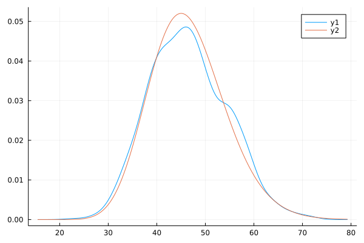
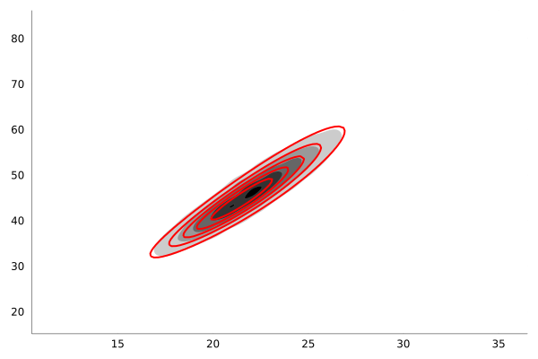

# RandomParamApprox

Sister repository to [https://github.com/ap-browning/RandomParameters](https://github.com/ap-browning/RandomParameters) which is itself the repository for the paper "Efficient inference and identifiability analysis for differential equation models with random parameters" published in [_PLOS Computational Biology_](https://doi.org/10.1371/journal.pcbi.1010734).

This repository contains a standalone Julia package which can be installed and used through the package manager.

## Installation

Simply run the following command from the `Pkg` environment.
```
add https://github.com/ap-browning/RandomParamApprox.jl
```


## Using the module

The module can be used to create an approximate transformed distribution for the transformation defined by `f` of the random variables `θ`.  

### Univariate transformation

Suppose we are interested in the random transformation 
```
    function f(θ)
        λ,R,r₀ = θ
        R / (1 + (R / r₀ - 1)*exp(-λ/3*10.0))
    end
```
i.e., the solution of the logistic model at time `t = 10`, where the parameters are give by
```
    using Distributions

    λ  = Normal(0.5,0.05)
    R  = Normal(300.0,50.0)
    r₀ = Normal(10.0,1.0)
    
    θ  = Product([λ,R,r₀])
```

We can construct a skewed approximation, and compare it to simulated data, using the following code
```
    using RandomParamApprox, Plots, StatsPlots

    d = approximate_transformed_distribution(f,θ;order=3)
    x = [f(rand(θ)) for i = 1:1000]

    density(x,label="Simulated")
    plot!(x -> pdf(d,x),label="Approximate")
```


### Multivariate transformations

We can construct a multivariate transformation in a similar way, if `f(θ)` outputs an `n`-dimensional vector.
```
    function f(θ)
        λ,R,r₀ = θ
        [R / (1 + (R / r₀ - 1)*exp(-λ/3*t)) for t in [5.0,10.0]]
    end

    d = approximate_transformed_distribution(f,θ,2;order=3)
    x = hcat([f(rand(θ)) for i = 1:10_000]...)

    xplt,yplt = [range(extrema(xi)...,100) for xi in eachrow(x)]
    dplt = [pdf(d,[xx,yy]) for xx in xplt, yy in yplt]
    density2d(eachrow(x)...,color=cgrad(:bone,rev=true),fill=true,lw=0.0,levels=5)
    contour!(xplt,yplt,dplt',c=:red,levels=5,lw=2.0)
```


Note that `order = 3` (i.e., based on a three-moment matched gamma distribution) can only be applied for two-dimensional transformations. 

__Matrix-valued outputs__

Often, the random transformation involves the numerical solution of an ODE (for example, the nonlinear two-pool model). If independent observations are made at multiple time points, it would be inefficient to solve `f(θ)` at each time point individually to construct an approximate transformed distribution at each time point. The module allows for _matrix-valued_ outputs from `f(θ)`, where the rows are interpreted as independent observations and each row is transformed seperately. For example, if `f(θ)` returns an `m × n` matrix,
```